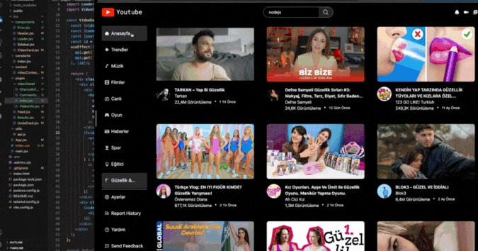

# YouTube clone Projeckt

This project is a fully responsive YouTube clone created using JavaScript, React, and APIs, featuring a stylish design compatible with any screen size. It replicates basic YouTube functions such as watching videos, viewing video details, and reading comments.

# Tools and Libraries Used

- JavaScript
- React
- React Router
- Context API
- Axios
- CSS
- HTML 
- axios
- react-icons
- react-router-dom
- react-player 
- millify 
- moment 
- tailwind 

# API

- https://rapidapi.com/ytjar/api/yt-api

# Screenshots

# Gif

